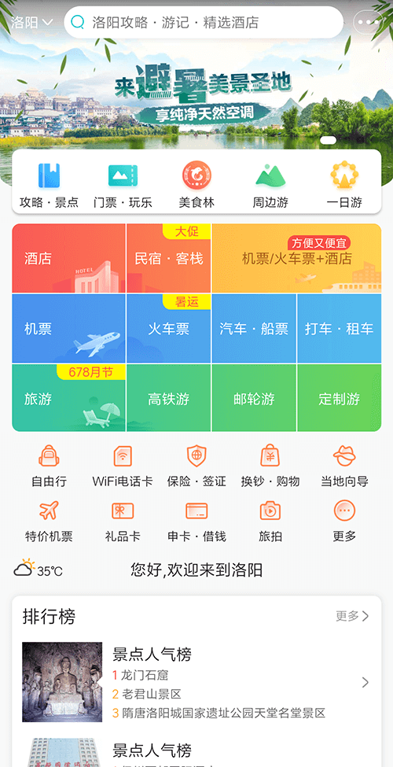
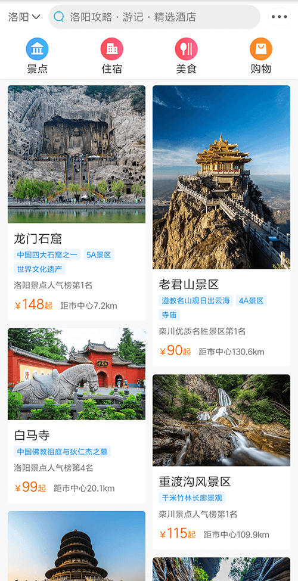
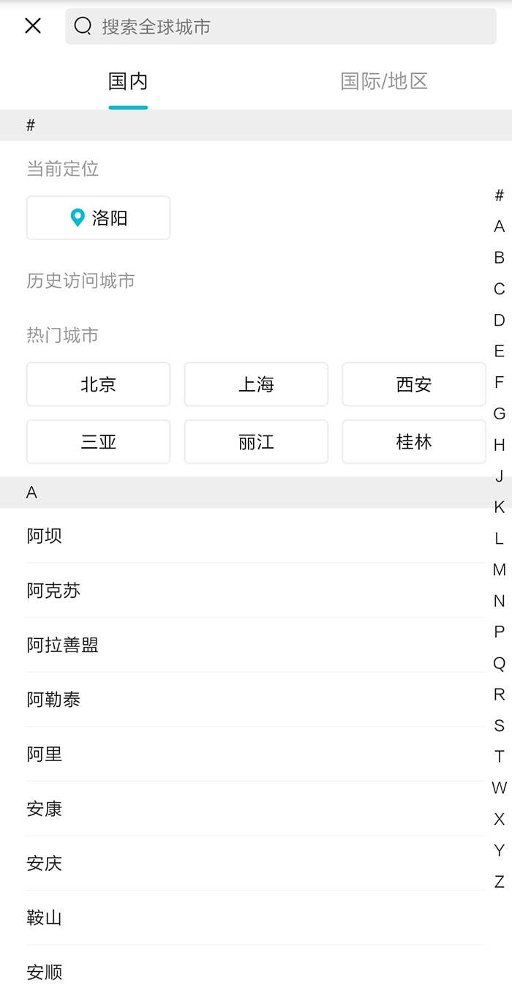

# Vue2.6 实战 高仿去哪儿旅行、携程移动端 App
[在线演示](http://cuihaojie.top/travel)

<div align="center">
    
    
    
</div>

### 介绍：
- 包含首页和城市选择页，首页采用瀑布流+无限滚动
- 使用 `Vue CLI 3.9` 脚手架工具快速搭建项目、辅助开发和打包文件
- 使用 `CSS3`、`HTML5` 结合 `JS` 完成静态页面，引用并封装 [`BetterScroll`](https://github.com/ustbhuangyi/better-scroll) 实现更好的滚动效果
- 使用 `axios` 请求后台数据
- 使用 `Vuex` 实现组件间的数据共享
- 使用 `Vue Router` 进行路由间切换，结合异步组件和过渡动画提高用户体验

### 技术栈
`JavaScript`、 `Stylus`、 `Vue`、 `Vuex`、 `Vue Router`、 `axios`、 `Babel(ES6)`


---

### 如何使用

```powershell
# 确保你的计算机上安装了 Vue CLI

# Project setup 安装所有依赖项
npm install

# Compiles and hot-reloads for development 支持热更新的开发模式
npm run serve

# Compiles and minifies for production 编译并打包
npm run build
```

### Customize configuration 自定义配置
See [Configuration Reference](https://cli.vuejs.org/config/).
